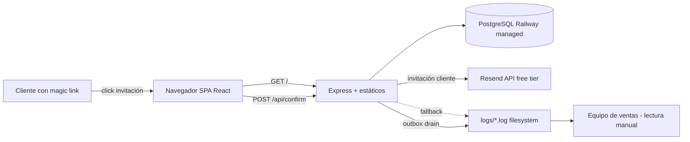
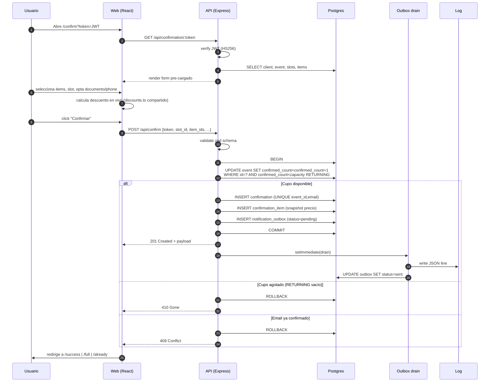
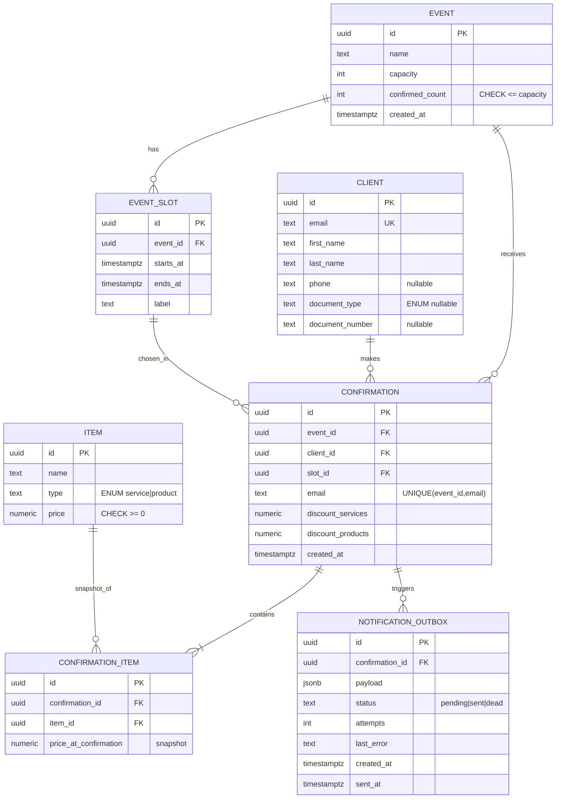

# Architecture — Plataforma de Confirmación de Asistencia

> Prueba técnica full-stack — evento de promociones anuales del depto. de ventas.
> Stack: Node 20 + TypeScript (strict) + React + Vite + PostgreSQL.
> Deploy: Railway free tier (servicio único + Postgres managed).

---

## 1. Vista de despliegue



Un único proceso Node sirve la SPA buildeada y la API en el mismo origen. Sin
CORS, sin segundo dominio, healthcheck en `/api/health`. La migración a 2 servicios
(frontend en CDN, backend aislado) es un cambio de despliegue, no de código.

---

## 2. Flujo de confirmación (end-to-end)



---

## 3. Modelo de datos



**Invariantes inquebrantables:**
1. `event.confirmed_count <= event.capacity` (CHECK constraint).
2. `UNIQUE(event_id, email)` en confirmation.
3. ≥ 1 item por confirmation (validación de aplicación).
4. `price_at_confirmation >= 0`.
5. Confirmation inmutable post-creación: no hay UPDATE ni endpoint de edición.

---

## 4. Concurrencia del cupo (decisión #4 del DECISIONS.md)

**Mecanismo elegido:** contador atómico con CAS (compare-and-swap) en una sola sentencia SQL.

```sql
UPDATE event
   SET confirmed_count = confirmed_count + 1
 WHERE id = $1
   AND confirmed_count < capacity
RETURNING confirmed_count, capacity;
```

Esta sentencia es **atómica e idempotente bajo carga**: Postgres garantiza row-level
locking implícito durante el UPDATE. Si `RETURNING` no devuelve fila, el cupo está
agotado y la transacción hace ROLLBACK sin tocar `confirmation`.

`reserveSeat(eventId, tx)` es la única función que incrementa el contador. Vive dentro
de la misma transacción que el `INSERT confirmation`, garantizando que **cupo y
confirmación se persisten o se descartan juntos**, sin estado inconsistente.

**Por qué no FOR UPDATE / advisory lock / CHECK con trigger:** detallado en `DECISIONS.md`.
Resumen: el contador atómico tiene mejor throughput bajo escenario 10x, métrica
observable y patrón CAS bien establecido.

**Verificación:** `tests/k6/capacity.js` corre 60 requests concurrentes contra cupo
50, asserta exactamente 50× 201 y 10× 410, y reconcilia `confirmed_count` ==
`COUNT(*) FROM confirmation` al final.

---

## 5. Notificación a ventas (decisión #5 del DECISIONS.md)

**Outbox pattern.** En la misma transacción que crea la `confirmation` se inserta una
fila en `notification_outbox` con `status='pending'`. Después del COMMIT, un drain
asíncrono (`setImmediate` en el mismo proceso) lee pendientes, escribe a
`logs/sales-notifications.log` (JSON line por evento) y marca `status='sent'`.

Si el drain falla: `attempts++`, `last_error`, retry exponencial. Tras 5 intentos:
`status='dead'`. Endpoint admin `POST /api/admin/outbox/drain` permite forzar el
drain manualmente desde la demo.

**Migración a producción:** swap del sink. La tabla outbox y la lógica de inserción
se mantienen idénticas; el `writeToLog()` se reemplaza por `publishToSQS()` o
equivalente. Cero cambios en el flujo de confirmación.

---

## 6. Estructura del repositorio

```
/
├── apps/
│   ├── api/                       Backend Express + TS
│   │   ├── src/
│   │   │   ├── index.ts           bootstrap + static serving
│   │   │   ├── config/env.ts      validación zod de envs
│   │   │   ├── db/pool.ts         pg pool + tx helper
│   │   │   ├── db/migrate.ts      runner SQL puro
│   │   │   ├── domain/
│   │   │   │   ├── discounts.ts   lógica pura
│   │   │   │   └── discounts.test.ts
│   │   │   ├── services/
│   │   │   │   ├── confirmation.ts  reserveSeat + INSERT
│   │   │   │   ├── outbox.ts        drain + retry
│   │   │   │   └── auth.ts          JWT verify
│   │   │   ├── routes/
│   │   │   │   ├── confirm.ts       POST /api/confirm
│   │   │   │   ├── event.ts         GET /api/event/:id
│   │   │   │   └── admin.ts         endpoints protegidos
│   │   │   └── lib/logger.ts
│   │   ├── migrations/
│   │   │   └── 001_init.sql
│   │   ├── Dockerfile               multi-stage único
│   │   └── package.json
│   └── web/                        Frontend Vite + React
│       ├── src/
│       │   ├── main.tsx
│       │   ├── App.tsx              router
│       │   ├── pages/
│       │   │   ├── ConfirmForm.tsx
│       │   │   ├── Success.tsx
│       │   │   ├── AlreadyConfirmed.tsx
│       │   │   ├── EventFull.tsx
│       │   │   └── InvalidToken.tsx
│       │   ├── components/
│       │   │   ├── ui/              shadcn (Button, Input, Card, ...)
│       │   │   ├── ConfirmationDetail.tsx
│       │   │   └── ItemSelector.tsx
│       │   ├── lib/
│       │   │   ├── api.ts           fetch wrapper
│       │   │   └── token.ts
│       │   └── hooks/useConfirmation.ts
│       └── package.json
├── packages/
│   └── shared/                     Schemas zod compartidos back/front
│       ├── schemas/
│       │   ├── confirmation.ts
│       │   └── discount.ts
│       └── package.json
├── tests/
│   ├── k6/capacity.js
│   └── manual-qa.md                checklist de 10 escenarios
├── docker-compose.yml              solo Postgres para dev local
├── package.json                    npm workspaces
├── README.md
├── DECISIONS.md
└── .env.example
```

---

## 7. Seguridad y sesión

- **Magic link JWT (HS256)**: payload `{client_id, email, event_id, iat, exp}`, exp 7 días.
- **Token reutilizable**, idempotencia garantizada por `UNIQUE(event_id, email)` en BD.
- **Endpoints admin** protegidos con `X-Admin-Token` (shared secret). Si no matchea: 404 (no 401, no revela existencia).
- **`JWT_SECRET` y `ADMIN_TOKEN`** validados en startup (mínimo 32 chars). Sin secreto válido, el proceso muere antes de aceptar tráfico.
- **No PII en URLs** salvo el JWT (que es la unidad de autenticación).
